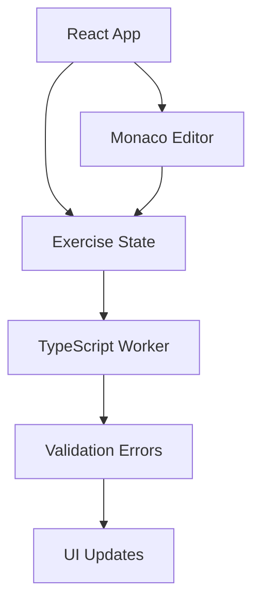

# How It Works

TypeScript Exercises is a sophisticated browser-based platform that provides a complete TypeScript development environment without requiring any backend infrastructure. This guide explains the technical architecture and how each component works together.

## Platform Architecture

The platform consists of several key components working together:



### Core Technologies

<CardGroup cols={2}>
  <Card title="React" icon="react">
    Component framework for the UI, managing state and user interactions
  </Card>
  
  <Card title="Monaco Editor" icon="code">
    The same code editor that powers VS Code, providing professional editing experience
  </Card>
  
  <Card title="TypeScript Compiler" icon="typescript">
    Runs in a Web Worker to provide real-time type checking without blocking the UI
  </Card>
  
  <Card title="RxJS" icon="diagram-project">
    Reactive programming for state management and asynchronous operations
  </Card>
</CardGroup>

## Monaco Editor Integration

The platform uses Monaco Editor to provide a professional code editing experience directly in the browser.

### Editor Setup and Configuration

From `src/components/monaco-editor/index.tsx:9-14`:
```typescript
languages.typescript.typescriptDefaults.setCompilerOptions({
    strict: true,
    target: languages.typescript.ScriptTarget.ES2018,
    moduleResolution: languages.typescript.ModuleResolutionKind.NodeJs,
    typeRoots: ['declarations']
});
```

<Info>
The platform enforces **strict mode** by default, ensuring you learn TypeScript best practices from the start.
</Info>

### Multi-File Support

Each exercise can have multiple files, and Monaco Editor manages models for all of them:

From `src/components/monaco-editor/index.tsx:64-79`:
```typescript
for (const [filename, {content, solution}] of Object.entries(props.values)) {
    this.lastUpdates[filename] = content;
    const language = extensionsToLanguages[filename.split('.').pop()!];
    const model = editor.createModel(content, language, Uri.file(`${props.namespace}/${filename}`));
    model.onDidChangeContent(
        debounce(() => {
            const newValue = model.getValue();
            this.lastUpdates[filename] = newValue;
            this.props.onChange(filename, newValue);
        }, 200)
    );
    this.models[filename] = model;
    if (solution !== undefined) {
        this.solutionsModels[filename] = editor.createModel(solution, language);
    }
}
```

### Key Features

<Accordion title="Debounced Change Detection">
  Changes are debounced by 200ms to avoid excessive validation while typing:
  
  From `src/components/monaco-editor/index.tsx:69`:
  ```typescript
  debounce(() => {
      const newValue = model.getValue();
      this.lastUpdates[filename] = newValue;
      this.props.onChange(filename, newValue);
  }, 200)
  ```
</Accordion>

<Accordion title="File Switching with View State">
  When switching files, editor state (cursor position, scroll) is preserved:
  
  From `src/components/monaco-editor/index.tsx:112-124`:
  ```typescript
  if (newSelectedFilename !== prevProps.selectedFilename) {
      const model = this.models[newSelectedFilename];
      this.viewStates[prevProps.selectedFilename] = this.instance.saveViewState()!;
      this.instance.setModel(model);
      this.instance.updateOptions({
          readOnly: Boolean(this.props.values[newSelectedFilename].readOnly)
      });
      revalidateModel(model);
      const viewState = this.viewStates[newSelectedFilename];
      if (viewState) {
          this.instance.restoreViewState(viewState);
      }
      this.instance.focus();
  }
  ```
</Accordion>

<Accordion title="Read-Only Files">
  Test files and library code are marked read-only:
  
  From `src/components/monaco-editor/index.tsx:85`:
  ```typescript
  readOnly: Boolean(props.values[props.selectedFilename].readOnly)
  ```
</Accordion>

<Accordion title="Solution Comparison">
  Each exercise includes reference solutions that can be compared side-by-side using Monaco's diff viewer.
</Accordion>

## TypeScript Compilation System

The platform runs the TypeScript compiler in a Web Worker to perform type checking without blocking the main UI thread.

### Worker-Based Type Checking

From `src/operators/check-type-script-project/index.ts:6-10`:
```typescript
interface TypeScriptService extends Worker {
    init(files: FileContents): Promise<void>;
    updateFiles(files: FileContents): Promise<void>;
    getErrors(): Promise<ValidationError[]>;
}
```

### RxJS Observable Pipeline

The validation system uses RxJS to create a reactive pipeline:

From `src/operators/check-type-script-project/index.ts:31-49`:
```typescript
export function checkTypeScriptProject(): OperatorFunction<FileTree, ValidationError[]> {
    return (parentObservable: Observable<FileTree>): Observable<ValidationError[]> => {
        const service = createService();
        return new Observable((subscriber) => {
            let initialized = false;
            let prevFiles = {} as FileContents;
            const subscription = parentObservable.subscribe(async (files) => {
                const contents = fileTreeToFileContents(files);
                if (!initialized) {
                    initialized = true;
                    prevFiles = contents;
                    await service.init(contents);
                } else {
                    const oldFiles = prevFiles;
                    const newFiles = contents;
                    prevFiles = contents;
                    await service.updateFiles(diffFiles(oldFiles, newFiles));
                }
                subscriber.next(await service.getErrors());
            });
```

<Note>
Only changed files are sent to the worker for incremental compilation, making validation very fast even as you type.
</Note>

### In-Memory File System

The TypeScript compiler operates on a virtual file system that exists entirely in memory. This allows simulating `node_modules`, type declarations, and multi-file projects without any server.

## Exercise Structure

Each exercise is defined as a file tree with specific properties.

### File Tree Definition

From `src/lib/file-tree.ts:1-7`:
```typescript
export interface FileTree {
    [filename: string]: {
        content: string;
        readOnly?: boolean;
        solution?: string;
    };
}
```

### Exercise Configuration

Exercises are structured consistently:

From `src/lib/exercise-structures.ts:18-28`:
```typescript
export const exerciseStructures: Record<string, FileTree> = {
    1: {
        '/index.ts': {
            content: require('!!raw-loader!../exercises/1/index.ts').default,
            solution: require('!!raw-loader!../exercises/1/index.solution.ts').default
        },
        '/test.ts': {
            content: require('!!raw-loader!../exercises/1/test.ts').default,
            readOnly: true
        },
        ...typeAssertions
    },
```

### File Types in Exercises

<Steps>
  <Step title="index.ts - Main Exercise File">
    The primary file where you write your solution. Contains the problem description and starter code.
    
    - Editable by default
    - Contains `unknown` types or incomplete type definitions
    - Includes helpful comments and documentation links
  </Step>
  
  <Step title="test.ts - Type Validation">
    Read-only file that validates your solution using type assertions.
    
    From `src/exercises/1/test.ts:1-6`:
    ```typescript
    import {IsTypeEqual, typeAssert} from 'type-assertions';
    import {User, logPerson, users} from './index';
    
    typeAssert<IsTypeEqual<User, {name: string, age: number, occupation: string}>>();
    typeAssert<IsTypeEqual<typeof users, {name: string, age: number, occupation: string}[]>>();
    typeAssert<IsTypeEqual<typeof logPerson, (user: {name: string, age: number, occupation: string}) => void>>();
    ```
  </Step>
  
  <Step title="node_modules - Simulated Dependencies">
    Some exercises include simulated npm packages to practice working with type declarations.
    
    - Contains JavaScript code (`.js` files)
    - May include existing type declarations (`.d.ts` files)
    - Package metadata (`package.json`, `README.md`)
  </Step>
  
  <Step title="declarations - Type Definition Files">
    In exercises 11-12, you write type declarations for JavaScript libraries:
    
    From `src/lib/exercise-structures.ts:137-140`:
    ```typescript
    '/declarations/str-utils/index.d.ts': {
        content: require('!!raw-loader!../exercises/11/declarations/str-utils/index.d.ts').default,
        solution: require('!!raw-loader!../exercises/11/declarations/str-utils/index.solution.d.ts').default
    },
    ```
  </Step>
  
  <Step title="module-augmentations - Module Extensions">
    Exercise 13 teaches module augmentation by having you extend existing type definitions:
    
    From `src/lib/exercise-structures.ts:191-194`:
    ```typescript
    '/module-augmentations/date-wizard/index.d.ts': {
        content: require('!!raw-loader!../exercises/13/module-augmentations/date-wizard/index.ts').default,
        solution: require('!!raw-loader!../exercises/13/module-augmentations/date-wizard/index.solution.ts').default
    },
    ```
  </Step>
</Steps>

## Test Validation System

The platform uses compile-time type assertions to validate solutions.

### Type Assertions Library

From `src/exercises/node_modules/type-assertions/index.ts:1-8`:
```typescript
/**
 * Checks if T1 equals to T2.
 */
export type IsTypeEqual<T1, T2> = IsNotAny<T1> extends false ? false : (
    IsNotAny<T2> extends false ? false : (
        [T1] extends [T2] ? ([T2] extends [T1] ? true : false): false
    )
);
```

From `src/exercises/node_modules/type-assertions/index.ts:51-54`:
```typescript
/**
 * A simple type assertion function which always expects a true-type.
 */
export function typeAssert<T extends true>() {}
```

### How Validation Works

1. **Type-level checks** - Uses TypeScript's type system to compare your types with expected types
2. **Compile-time only** - No runtime code execution required
3. **Exact matching** - `IsTypeEqual` ensures your types match exactly, not just assignability
4. **Prevents `any` usage** - `IsNotAny` helper prevents cheating with `any` types

<Tip>
The test system validates types at compile time, not runtime. This means it checks what TypeScript *knows* about your types, not what happens when code executes.
</Tip>

## State Management

The platform uses RxJS observables for reactive state management.

### Exercise State Observable

From `src/containers/exercise/index.tsx:90-93`:
```typescript
const exercise = useMemo(() => createExercise(exerciseNumber), [exerciseNumber]);
const validationErrors$ = useMemo(() => exercise.observable$.pipe(checkTypeScriptProject()), [exercise]);
```

### File Content Updates

From `src/containers/exercise/index.tsx:116-120`:
```typescript
const onChange = useCallback(
    (filename: string, content: string) => {
        exercise.update(filename, content);
    },
    [exercise]
);
```

Changes flow through the system:
1. User types in Monaco Editor
2. Change event fires (debounced 200ms)
3. Exercise state updates
4. Observable emits new file tree
5. TypeScript worker revalidates
6. Errors update in UI

<Info>
All state updates are reactive. When you change code, validation happens automatically without manual triggering.
</Info>

## Progress Tracking

Your progress through exercises is automatically saved to browser local storage.

### Completion Detection

From `src/containers/exercise/index.tsx:174-189`:
```typescript
{errors.length === 0 && (
    <CompletedExerciseWrapper>
        <CompletedExerciseLabel color={theme.color}>
            {exerciseNumber === lastExerciseNumber ? (
                <>Congratulations! That was the last exercise.</>
            ) : (
                <>Good job! Exercise {exerciseNumber} is completed.</>
            )}
        </CompletedExerciseLabel>
        {exerciseNumber !== lastExerciseNumber && (
            <ButtonsWrapper color={theme.color} backgroundColor={theme.background}>
                <button onClick={exercisesProgress.completeExercise}>Next exercise</button>
                <button onClick={showSolutions}>Compare my solution</button>
            </ButtonsWrapper>
        )}
    </CompletedExerciseWrapper>
)}
```

When `errors.length === 0`, the exercise is considered complete.

## UI Components

The interface is built with several specialized React components:

<CardGroup cols={2}>
  <Card title="FileTreeView" icon="folder-tree">
    Displays the file structure with expand/collapse functionality and modified file indicators
  </Card>
  
  <Card title="ValidationErrors" icon="circle-exclamation">
    Shows TypeScript errors with clickable links to navigate to error locations
  </Card>
  
  <Card title="CollapsiblePanel" icon="window-minimize">
    Resizable panels for the file sidebar and error panel
  </Card>
  
  <Card title="DiffDialog" icon="code-compare">
    Side-by-side comparison view for comparing solutions
  </Card>
</CardGroup>

## Theme Support

The platform includes light and dark themes that apply to both the UI and Monaco Editor.

From `src/containers/exercise/index.tsx:146`:
```typescript
theme={theme.style === 'light' ? 'vs' : 'vs-dark'}
```

Theme preference is persisted in local storage.

## Performance Optimizations

### Incremental File Updates

Only changed files are sent to the TypeScript worker:

From `src/operators/check-type-script-project/index.ts:22-28`:
```typescript
function diffFiles(oldFiles: FileContents, newFiles: FileContents) {
    return Object.keys(newFiles).reduce((res, filename) => {
        if (newFiles[filename] !== oldFiles[filename]) {
            res[filename] = newFiles[filename];
        }
        return res;
    }, {} as FileContents);
}
```

### Debounced Validation

Changes are debounced to avoid excessive recompilation while typing.

### Code Splitting

The TypeScript compiler runs in a separate Web Worker, preventing UI blocking during type checking.

## Key Design Decisions

<Accordion title="Why Web Workers for TypeScript?">
  Running TypeScript compilation in the main thread would freeze the UI. Web Workers allow the editor to remain responsive even during complex type checking.
</Accordion>

<Accordion title="Why In-Memory File System?">
  An in-memory file system allows simulating complex project structures (with `node_modules`, type declarations, etc.) without requiring a backend server or file storage.
</Accordion>

<Accordion title="Why Strict Mode?">
  Strict mode enforces best practices from the start. Learning TypeScript without strict mode can lead to bad habits that are hard to break later.
</Accordion>

<Accordion title="Why Type Assertions Instead of Runtime Tests?">
  TypeScript's power is in compile-time type checking. Runtime tests would miss the point - the goal is to teach proper type usage, not runtime behavior.
</Accordion>

## Building and Deployment

The platform is a static site that can be deployed to GitHub Pages or any static hosting.

From `package.json:63-64`:
```json
"start": "EXTEND_ESLINT=true react-app-rewired start",
"build": "EXTEND_ESLINT=true react-app-rewired build"
```

The build process:
1. Bundles React application with webpack
2. Includes Monaco Editor via webpack plugin
3. Embeds all exercise files using raw-loader
4. Produces static HTML/JS/CSS bundle
5. Deploys to GitHub Pages

## Contributing to Exercises

Want to add new exercises? Here's the structure:

<Steps>
  <Step title="Create exercise directory">
    Create a new directory under `src/exercises/` with the exercise number.
  </Step>
  
  <Step title="Add source files">
    - `index.ts` - Problem statement and starter code
    - `index.solution.ts` - Reference solution
    - `test.ts` - Type assertions to validate the solution
  </Step>
  
  <Step title="Update exercise-structures.ts">
    Add your exercise to the `exerciseStructures` object.
  </Step>
  
  <Step title="Test locally">
    Run `yarn start` and verify your exercise works correctly.
  </Step>
</Steps>

## Next Steps

<CardGroup cols={2}>
  <Card title="Start Exercises" icon="play" href="https://typescript-exercises.github.io/">
    Begin your TypeScript learning journey
  </Card>
  
  <Card title="Contribute" icon="code-pull-request" href="https://github.com/typescript-exercises/typescript-exercises">
    Help improve the platform or add new exercises
  </Card>
</CardGroup>